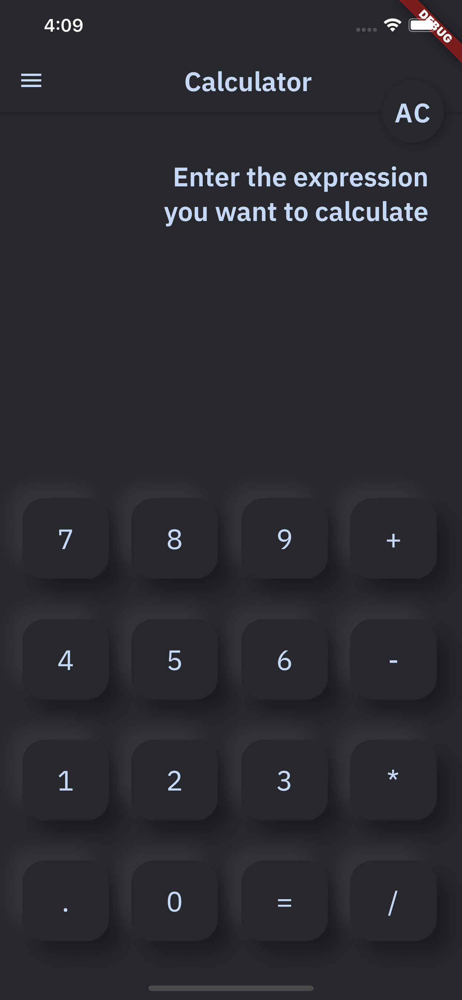

# flutter_calc

A new Flutter project.

## Getting Started

This is a Calculator app made entirely in Flutter. 
It can be used for basic calculations, and supports light/dark Themes.
It is based on Neumorphic Design and uses url_launcher and expression_language as it's dependencies.

## Screenshots

         

## Old Screenshots (showing functionality)

         

         

## Usage

You can download the app from the build\app\outputs\apk\release\app-release.apk
